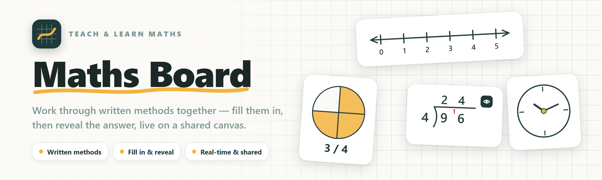

# Maths Board

**▶ Try it live at [mathsboard.mixedmode.ch](https://mathsboard.mixedmode.ch)** — open it and start, or share a board to work together in real time.

Maths Board is a free, open-source **maths whiteboard for teaching and learning
together**. It's an infinite canvas where you demonstrate a written method,
place the maths widget you need, and **reveal the worked answer step by step** —
live, with whoever you're teaching. Built for one-to-one online tuition, but
just as at home in a small group, a classroom, or at the kitchen table.

## Why Maths Board?

It started with a simple problem: **teaching maths to a child over a video
call.** A tutor demonstrates a method; the learner follows on a tablet. Doing
that well today means juggling three tools that were never meant for it — a
generic whiteboard for scribbling, a graphing app, and a separate manipulatives
site — and none of them actually *does* the written methods a primary child is
learning.

- **General whiteboards** (Miro, Excalidraw) are brilliant at pen and sticky
  notes, but they know nothing about maths.
- **Maths tools** (Polypad, MathsBot, the Math Learning Center apps) have lovely
  manipulatives, but most are single-device and don't collaborate.
- **Tutoring whiteboards** collaborate, but stop at a pen and an equation editor.

Maths Board is **one surface** built around the thing that matters: setting out
a method, working through it together, and checking the answer — with the
learner acting on their own screen, in real time.

## What makes it different

- **✍️ Written-method scaffolds with answer-reveal.** The core of the app. Set
  up a **bus-stop division**, **grid / column multiplication**, **long
  division**, **chunking** and more, fill it in with your learner, then flip the
  **reveal** toggle to show the fully worked answer — carries, remainders and
  all. No general whiteboard does this.
- **✅ Self-marking practice.** Drop in a quiz / worksheet; the learner types
  answers and gets them marked instantly. Answers and marks sync live.
- **👥 Real-time collaboration made for tuition.** Share a link (or a short
  code); everyone edits the same board live with visible cursors. Undo is
  **per-person** — you'll never undo your learner's work.
- **🔌 Works anywhere, no sign-up.** Fully usable solo and offline in the
  browser — boards save to your device. No account required, ever.
- **📲 Install it like an app.** Maths Board and the Language Board are
  **separate installable apps** (PWAs) — add either to your Android or iOS home
  screen and it opens full-screen and works offline.

## The maths toolbox

Over 20 purpose-built tools, grouped the way you'd reach for them. Most
calculating tools support the **fill-in-then-reveal** answer toggle.

| Group | Tools |
|---|---|
| **Number & calculating** | Number line · Times tables · Grid / box multiplication · Short & long multiplication · Arrays · Area / lattice · Bus-stop & long division · Chunking · Place value |
| **Practice — type & check** | Self-marking quiz / worksheet |
| **Fractions, decimals & %** | Fraction bars & circles · Fraction wall · Fraction of an amount · Percentage of an amount · Fraction ↔ decimal ↔ % |
| **Geometry** | Coordinate grid · Protractor & angles |
| **Time** | Analog clock (12h / 24h) |
| **Word problems** | Problem cards |
| **Notation & media** | Proper maths notation (fractions, powers, √) via an in-place equation editor · Text · Pictures |

## Language Board

The same infinite canvas, retuned for **learning languages** — live at
**[languageboard.mixedmode.ch](https://languageboard.mixedmode.ch)** (its own
installable app). On the way in you choose the language you already speak and the
one you want to learn (**English ↔ French** to start, built to add more), and the
Insert gallery swaps the maths widgets for language activities aimed at beginners
(around 10 years old):

| Group | Activities |
|---|---|
| **Learn — words & sentences** | Vocabulary **flash cards** (flip to check, self-rate) · a **phrasebook** of basic sentences (tap to reveal the translation) · **My words** — an editable table to capture your own words & sentences with their translations |
| **Practise — games** | **Match up** — draw a line from each word to its translation · **Sentence builder** — put the scrambled words in the right order |

Everything else — the pen, shapes, pictures, real-time collaboration, save &
share — works exactly as it does on the maths board.

## Who it's for

- **One-to-one online tutoring** — the reason it exists. Demonstrate a method on
  a shared board; your learner follows and works on their own tablet.
- **Small-group tuition & interventions** — everyone on one board, live.
- **In the classroom** — project it to the room, or have students join a shared
  board.
- **Homework help at home** — a parent and child on the same canvas.
- **Solo & self-study** — no backend needed; it runs entirely in the browser and
  saves locally.

## Privacy & open source

Maths Board is **privacy-first by design** — it's a tool for children, so it
collects as little as possible. No accounts, no tracking, no third-party
cookies. Boards you work on alone never leave your browser; a board only reaches
a server when you **Share** it, and the hosted version runs on **Swiss
infrastructure under Swiss data-protection law**.

It's **free and open-source software** under the **AGPL-3.0** license — use it,
study it, modify it, and share it. Full detail, credits to the open-source
projects it stands on, and exactly what happens to your data are in
[**About & credits**](ABOUT.md).

## Run it yourself & contribute

Everything technical — local setup, architecture, tests, and self-hosting your
own instance (a single small VPS, two board domains, roughly €3–4/month) — is in the
[**Development & self-hosting guide**](DEVELOPMENT.md). Where the product is
headed lives in the [feature roadmap](docs/feature-roadmap.md).

## License

[AGPL-3.0](LICENSE) · © 2026 Adrien Fauconnet and the Maths Board contributors.
