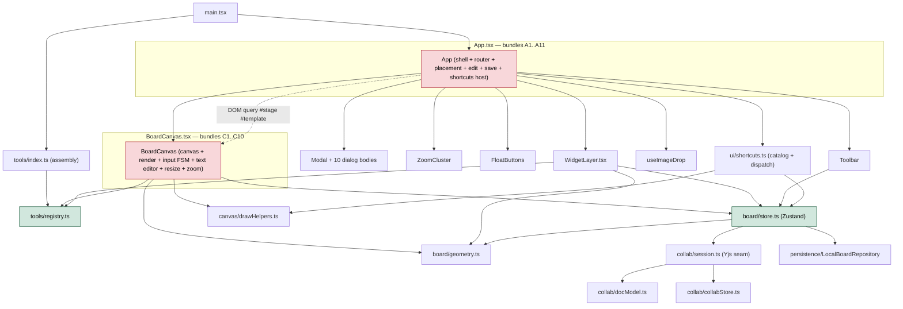
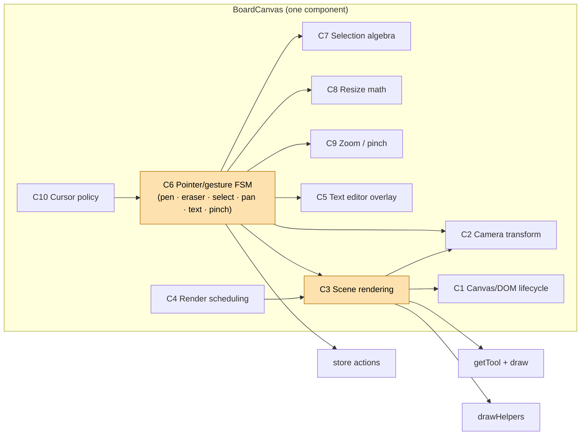
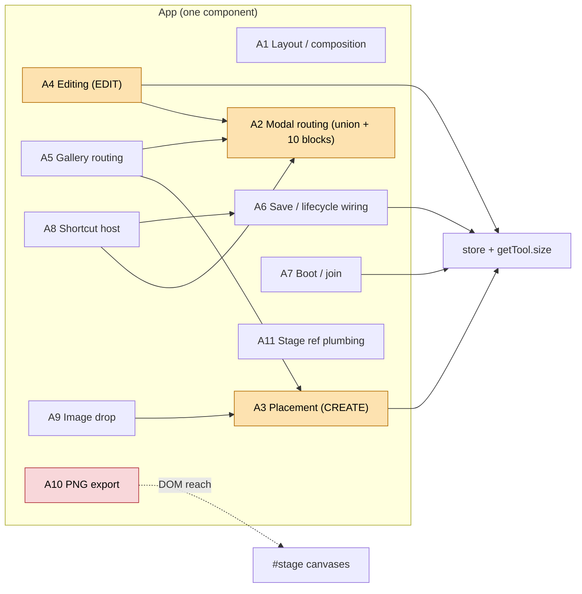
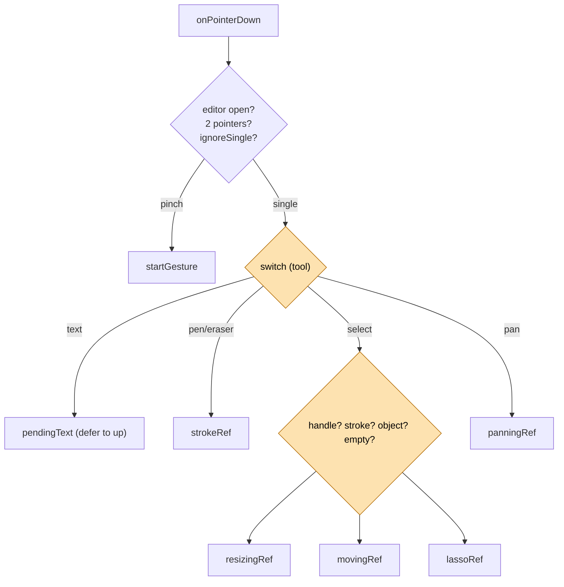
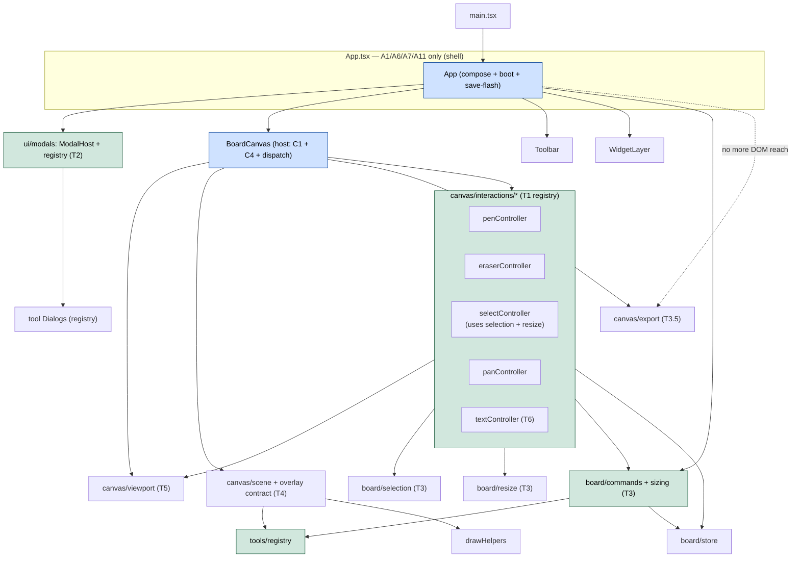
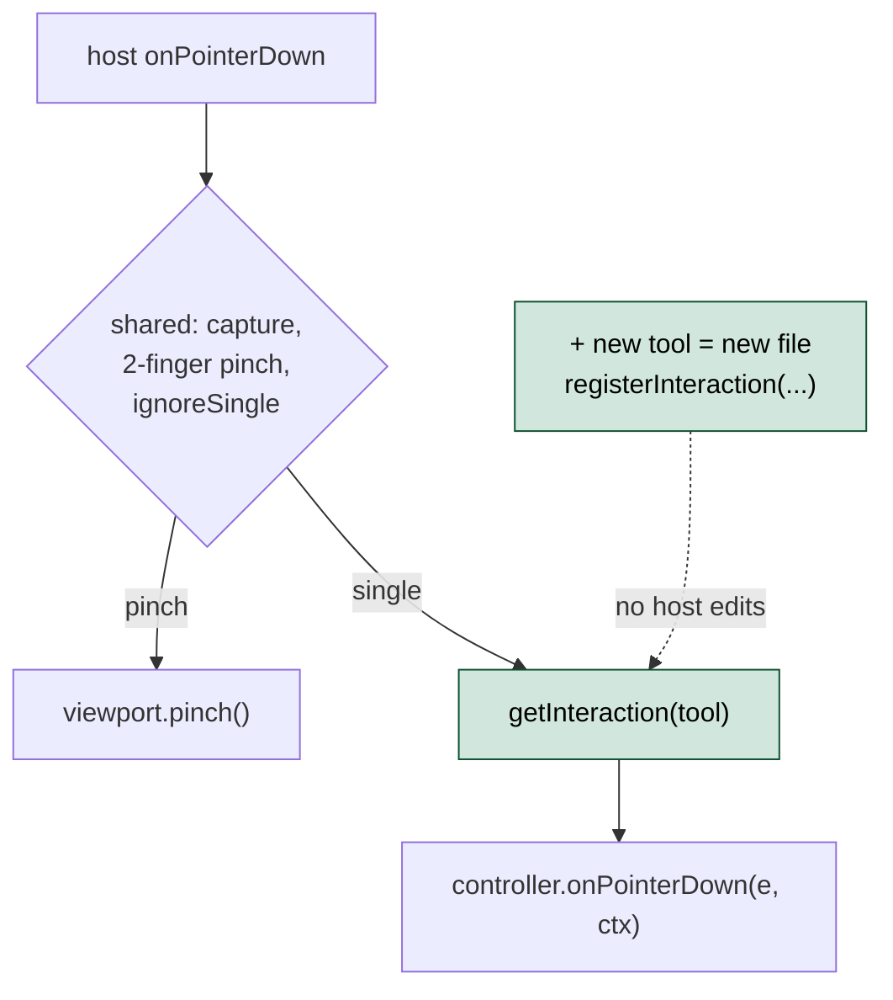
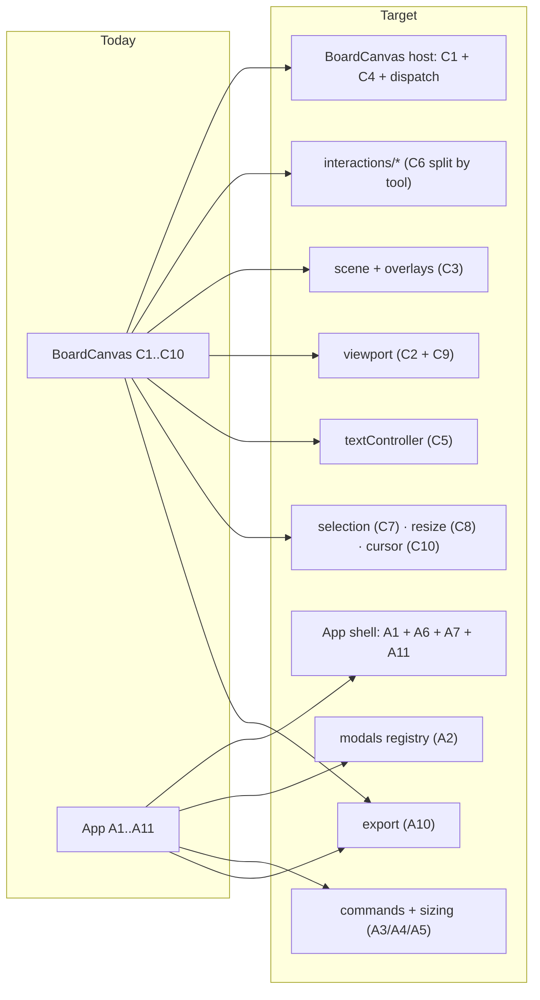

# BoardCanvas + App: concern map and abstraction plan

> **Why this doc exists.** `src/canvas/BoardCanvas.tsx` (~1140 lines) and
> `src/App.tsx` (~510 lines) have become the two "god" modules of the app. Both
> grow every time a feature is added, because both bundle many unrelated
> concerns behind one React component. This document (1) inventories what each
> file actually does, (2) diagrams the current shape, (3) proposes the small set
> of abstractions worth building **now** so features can be added without
> bloating these two files further, and (4) diagrams the target shape.

The guiding rule for "worth building now": an abstraction earns its place if a
**plausible next feature** would otherwise force an edit to the middle of a
500-line handler or a 120-line modal switch. Registries and services that only
save a few lines are noted but deferred.

> **Status: IMPLEMENTED (2026-07).** T1–T6, the Tier-3 tidies and both cheap
> wins have landed. The new modules: `canvas/interactions/*` (T1),
> `ui/modals/*` (T2), `board/sizing.ts` + `board/commands.ts` (T3, includes
> the internal clipboard), `canvas/scene.ts` (T4, with rAF render batching),
> `canvas/viewport.ts` (T5), `canvas/textEditor.ts` (T6), `board/selection.ts`
> / `board/resize.ts` / `canvas/export.ts` (Tier 3). §1–§2 below describe the
> PRE-refactor shape and are kept as the rationale; §4 is now the actual shape.
> The once-open §6 item (data-driving the Toolbar dock from the registry)
> landed with the follow-up refactor — see docs/tool-architecture-refactor.md,
> which also unified styling, edit routing and the creation ritual.

---

## 1. Concern inventory

### 1.1 `BoardCanvas.tsx` — what lives inside one component

| # | Concern | Representative code | Notes |
|---|---------|--------------------|-------|
| C1 | **Canvas/DOM lifecycle** | `tCanvasRef`, `iCanvasRef`, `taRef`, `viewRef`, `resize()` | Two stacked `<canvas>` + textarea; dpr sizing; window-resize wiring. |
| C2 | **Camera → pixel transform** | `applyCam`, `evPos` | `setTransform` with dpr; client→canvas coord mapping. |
| C3 | **Scene rendering** | `renderBack`, `renderInk`, `renderAll` | Grid, per-object natural-space scale+draw, selection outlines, resize handles, lasso rect, committed strokes, live stroke, brush ring. |
| C4 | **Render scheduling** | `renderAllRef`, store `subscribe` effect | Redraw on board/camera/tool/size/selection/editing changes. Synchronous, no batching. |
| C5 | **Text editor overlay** | `openEditor`, `autoSize`, `commitEditor`, `<textarea>` | Textarea positioning math, font/scale recovery, empty→remove vs `updateObject`. |
| C6 | **Pointer/gesture state machine** | `onPointerDown/Move/release`, 11 imperative refs | The bulk of the file. Dispatches by `tool`: pen/eraser, select (resize/move/collapse), lasso, pan, deferred text, two-finger pinch, capture, `ignoreSingle`. |
| C7 | **Selection algebra** | `singleSelection`, `toggleSelection`, `isInSelection`, `HitKind` | Pure helpers; also the "collapse multi-select on click" rule lives inside `release`. |
| C8 | **Resize math** | `resizeRect`, `singleResizableObject`, `RESIZE_CURSOR`, `HANDLE_SLOP`, `MIN_OBJ` | Aspect-locked box derivation + which object is resizable + cursor per handle. |
| C9 | **Zoom / pinch** | `zoomAt`, `zoomAtRef`, `startGesture`, `updateGesture`, wheel handler | Camera manipulation shared by wheel, pinch, and (indirectly) `ZoomCluster`. |
| C10 | **Cursor policy** | tool-cursor effect, hover-cursor branch in `onPointerMove` | Which cursor per tool; resize-handle hover feedback. |

**Reading:** C6 is the megafunction; C3 is the second-largest. C2, C7, C8, C9,
C10 are self-contained and only *live* here for historical reasons. C5 is a
cohesive sub-feature that could stand alone.

### 1.2 `App.tsx` — what the shell bundles

| # | Concern | Representative code | Notes |
|---|---------|--------------------|-------|
| A1 | **Layout / composition** | the big `return (...)` | Toolbar, `#stage` (BoardCanvas, WidgetLayer, PresenceLayer, ZoomCluster, drop overlay), FloatButtons, PaperMenu. |
| A2 | **Modal routing** | `ModalState` union, ~10 `<Modal>` blocks, `dialogNode` | Hand-rolled router: welcome/insert/dialog/boards/saveAs/share/join/joinName/help + collab gating repeated inline. |
| A3 | **Object placement (CREATE)** | `placeNew`, `toolSize`, `paramsOf` | Size via `tool.size`, centre-on-screen + cascade, `addObject`+`select`+`setTool`. |
| A4 | **Object editing (EDIT)** | `applyEdit`, `openEditFor`, `editSelected`, `handleDialogSubmit` | Recompute size **preserving uniform scale**; route dialog submit create-vs-edit. |
| A5 | **Insert-gallery routing** | `handlePick` | Dialog-vs-direct-place decision. |
| A6 | **Save / lifecycle wiring** | `doSave`, `doSaveAs`, `handleSaveAsSubmit`, `flashSaved`, `savedFlash` toast | Thin async+flash wrappers over store actions. |
| A7 | **Boot / join** | mount effect, `handleJoinName` | Share-link vs welcome; name prompt before join. |
| A8 | **Shortcut host** | `ShortcutHost` build + keydown effect | Supplies the modal/save actions `shortcuts.ts` can't do itself. |
| A9 | **Image drop** | `useImageDrop` → `placeNew` | Collab-only drop-to-place. |
| A10 | **PNG export** | `saveImage` | **Reaches into BoardCanvas's DOM** (`#stage #template`/`#ink`) — a leaky coupling. |
| A11 | **Stage ref plumbing** | `setStageRef`, `stageEl`, `getStageSize` | Portal target + measurement for FloatButtons/ZoomCluster. |

**Reading:** A3+A4+A5 are one logical service (object CRUD orchestration) split
across the shell. A2 is a router that grows linearly with features. A10 is a
coupling smell. Everything else is genuinely shell-level and can stay.

---

## 2. Current-state diagrams

### 2.1 Module dependency map (today)



The two red nodes are the overloaded modules. Note the dashed edge: App reaches
into BoardCanvas's DOM to export PNG (concern A10) — the only place the shell
knows canvas internals.

### 2.2 Inside `BoardCanvas` (today)



### 2.3 Inside `App` (today)



### 2.4 The pointer dispatch today (the growth pain)



> Every new interactive tool today = edits in **three** hand-written handlers
> (`onPointerDown`, `onPointerMove`, `release`) plus a new imperative ref plus a
> new branch in `renderBack`/`renderInk` for its overlay. That is the bloat the
> abstractions below remove.

---

## 3. Abstraction candidates

Ranked by leverage. Tier 1 = build now; Tier 2 = build alongside Tier 1 as the
extraction that makes it clean; Tier 3 = cheap tidies, do opportunistically.

### Tier 1 — build now

#### T1. Interaction-controller registry (`ToolName` → behaviour)

**The single highest-leverage change.** Today the app has *two* tool axes and
only one is abstracted:

- **Placeable tools** (numberline, clock, worksheet, …) → already a clean
  registry (`tools/registry.ts`, `defineCanvasTool`/`defineWidgetTool`).
- **Interaction tools** (`ToolName = pen | text | eraser | select | pan`) →
  **hardcoded** as a `switch (tool)` spread across C6.

Give interaction tools the same treatment: a registry of controllers, each a
small object implementing a shared interface. The host keeps only the *shared*
input infrastructure — pointer bookkeeping, two-finger pinch/pan detection,
capture, and dispatch to the active controller.

```ts
// canvas/interactions/types.ts
export interface InputCtx {
  store: typeof useBoardStore;          // getState/setState
  camera(): Camera;
  toWorld(sx: number, sy: number): Pt;  // screen→world for the live camera
  render(): void;                       // request a scene redraw (batched)
  canvas: HTMLCanvasElement;
}

export interface InteractionController {
  readonly tool: ToolName;
  cursor?: string;                                   // static cursor for the tool
  hoverCursor?(e: PointerEvent, c: InputCtx): string | null;
  onPointerDown(e: PointerEvent, c: InputCtx): void;
  onPointerMove(e: PointerEvent, c: InputCtx): void;
  onPointerUp(e: PointerEvent, c: InputCtx): void;   // also handles pointercancel
  onDoubleClick?(e: MouseEvent, c: InputCtx): void;
  /** Contribute a preview overlay (lasso, brush ring, resize handles, drag
   *  ghost). Drawn after the scene, in the active camera transform. */
  drawOverlay?(kit: DrawKit, c: InputCtx): void;
}

// canvas/interactions/index.ts
registerInteraction(penController);
registerInteraction(eraserController);
registerInteraction(selectController);   // owns resize + move + lasso + collapse
registerInteraction(panController);
registerInteraction(textController);     // owns the text-editor overlay (T2/T6)
```

- **Pinch/zoom and wheel stay in the host**, not per tool — they already cut
  across every tool (the two-finger branch cancels whatever single-pointer
  action is live). This is the "shared services" half of the seam.
- Each controller owns its own live state (the current `strokeRef`,
  `movingRef`, … become locals/closures of their controller instead of 11
  refs on the component).

**Unblocks:** shape tool, line/arrow/connector, highlighter, laser pointer,
sticky-note, measuring tool — each is *one new file*, `registerInteraction(...)`,
zero edits to existing controllers or to `renderBack`.

**Effort:** medium-high (it's the big one). **Risk:** medium — pointer/gesture
behaviour is subtle (deferred text, multi-select collapse, `ignoreSingle`).
Mitigate by extracting controllers one at a time behind the registry, pen first,
select last.

#### T2. Modal registry + `ModalHost`

Replace the `ModalState` union + ~10 inline `<Modal>` blocks + `dialogNode`
with a registry keyed by `kind`, and a single `<ModalHost>`.

```ts
// ui/modals/types.ts
export interface ModalDef<S extends ModalState = ModalState> {
  kind: S["kind"];
  collabOnly?: boolean;                 // declared once, not re-checked inline
  render(state: S, api: ModalApi): ReactNode;
}
export interface ModalApi {
  close(): void;
  open(next: ModalState): void;         // e.g. dialog "Back" → { kind: "insert" }
}

// ui/modals/index.ts — the registry
export const MODALS: ModalDef[] = [welcomeModal, insertModal, dialogModal, ...];

// App shrinks to:
<ModalHost state={modal} onOpen={setModal} onClose={closeModal} />
```

**Unblocks:** any new dialog/flow is a registry entry; collab-gating is a flag,
not repeated `COLLAB_ENABLED && modal?.kind === …` guards; App loses ~120 lines
of A2. Keeps the existing `Modal` shell + `uiStore.modalOpen` behaviour intact
underneath.

**Effort:** low-medium. **Risk:** low — pure view routing, no behaviour change.

#### T3. Board-command service + one sizing authority

Pull A3/A4/A5 out of the shell into a store-adjacent service, and collapse the
**three** copies of "recompute box while preserving uniform scale" into one
module. Those copies today: `App.applyEdit`, `BoardCanvas.commitEditor`, and the
resize/`textSizeOf` paths; `shortcuts.cloneShapes` is a fourth placement path.

```ts
// board/sizing.ts — the single authority
export function naturalSize(type: string, params: Params): Size | null;   // tool.size | defaultSize
export function scaleOf(obj: AnyBoardObject): number;                      // stored box ÷ natural
export function sizedBox(type: string, params: Params, scale: number): Size;
export function paramsOf(obj: AnyBoardObject): Params;

// board/commands.ts — orchestration (thin, calls store actions)
export function placeObject(type, params, opts?: { at?: ScreenPt; cascade?: boolean }): void;
export function editObject(id: string, params: Params): void;             // preserves scale
```

**Unblocks:** every placement path (gallery, drop, paste, future "insert
template", future right-click-insert) goes through `placeObject`; the
scale-preservation bug class disappears because there's one implementation.
App's A3/A4/A5 become 3-line delegations; `shortcuts.ts` and `WidgetLayer` can
reuse the same service.

**Effort:** low-medium. **Risk:** low — mechanical, well-covered by existing
behaviour.

### Tier 2 — extract these to make Tier 1 clean

#### T4. Scene renderer + overlay contract

Move C3 out of the component into a pure-ish `canvas/scene.ts`:
`renderScene({ tctx, ictx }, state)` draws grid + objects + committed strokes.
**Interaction previews** (lasso, brush ring, resize handles, live stroke, future
drag ghosts) move to the active controller's `drawOverlay` (T1). BoardCanvas
keeps only C1 (canvas refs) + C4 (scheduling) + the input host.

Pairs naturally with T1: once overlays are contributed by controllers,
`renderBack` stops being an ever-growing list of `if (tool === …)` blocks.

**Effort:** medium. **Risk:** medium (rendering is perf-sensitive; keep the
same draw order).

#### T5. Viewport / camera controller (`useViewport`)

C2 + C9 (+ wheel) become a small controller shared by the input host and
`ZoomCluster`: `applyCam`, `toWorld`, `zoomAt`, `panBy`, `pinch(start/update)`.
Removes the `zoomAtRef` ref-dance and the conceptual duplication between wheel
zoom, pinch zoom, and the cluster buttons.

**Effort:** low-medium. **Risk:** low.

#### T6. Text-editor controller

C5 becomes either a `useTextEditor` hook or (preferred) the internals of the
`textController` from T1 — it already *is* a self-contained flow
(open/autosize/commit + the tricky positioning math). Keeps the textarea in
BoardCanvas's JSX but moves the logic out.

**Effort:** low. **Risk:** low-medium (the positioning math + mobile
keyboard/resize caveat must be preserved verbatim).

### Tier 3 — cheap tidies

- **`board/selection.ts`** — move C7 (`singleSelection`/`toggle`/`isInSelection`
  + the collapse rule) next to `selectionCount`, already in the store.
- **`board/resize.ts`** — move C8 (`resizeRect`, `singleResizableObject`,
  `RESIZE_CURSOR`, `HANDLE_SLOP`, `MIN_OBJ`) beside `geometry.ts`.
- **`canvas/export.ts`** — fix A10: register the two canvas elements (or expose
  a `toPNG()` via a ref/store) so the shell stops querying
  `#stage #template`. Removes the only App→BoardCanvas DOM coupling.
- **Render batching** — when extracting T4, wrap `render()` in a
  `requestAnimationFrame` coalescer so a burst of pointer moves paints once.

### Explicitly NOT worth abstracting yet

- The `ToolCategory` taxonomy, `drawHelpers` primitives, `geometry` helpers —
  already clean; leave them.
- The collab/session/docModel seam — already a well-factored service; no change.
- A general "command bus"/undo-command pattern — the Yjs `UndoManager` +
  `pushHistory` already own history; a second command layer would be redundant.
- Splitting the store — `board/store.ts` is large but cohesive; its lifecycle
  actions belong together. Don't fragment it chasing line count.

---

## 4. Future-state diagram

### 4.1 Target module shape



Both former god-modules (blue) are now thin **hosts**; the behaviour lives in
**registries/services** (green) that features extend without editing the hosts.

### 4.2 Pointer dispatch, after T1



### 4.3 What each concern becomes



---

## 5. Suggested sequencing

Order chosen so each step is independently shippable and low-risk before the
riskier ones:

1. **T3 (commands + sizing)** — pure refactor, no UI change, kills duplication,
   immediately shrinks App. Safest first win.
2. **T2 (modal registry)** — view-only routing change; big readability payoff in
   App; independent of the canvas work.
3. **T5 (viewport)** + **T3.5 (export)** — small, self-contained canvas
   services; prep the ground for the input refactor.
4. **T4 (scene + overlay contract)** — establish `drawOverlay` before moving
   interaction previews onto controllers.
5. **T1 (interaction registry)** — the big one; migrate controllers one at a
   time (pen → eraser → pan → text/T6 → select), each behind the registry, so
   behaviour can be verified per tool. **T6** rides in with the text controller.
6. **T3 tidies (selection, resize modules)** — fold in as `selectController` is
   extracted.

After step 5, adding an interactive tool or a modal/dialog is an additive file
plus one `register…()` call — no edits to `BoardCanvas` or `App`.

---

## 6. Other files audited (large vs god)

`BoardCanvas` is the largest file, but line count alone doesn't identify what
needs breaking down. The distinction that matters:

- **God file** — tangles many *unrelated* concerns behind one unit. Splitting it
  is a genuine decomposition. Only `BoardCanvas.tsx` (and, to a lesser degree,
  `App.tsx`) qualifies.
- **Large-but-cohesive** — big because its *single* concern is intrinsically
  large (a declarative catalog, a store, an external seam). Splitting for line
  count fragments cohesion and makes things worse.

Sizes below are from `wc -l` over `src/`.

| File | Lines | God file? | Verdict |
|------|------:|-----------|---------|
| `canvas/BoardCanvas.tsx` | 1137 | **Yes** | The only true god file — see §1.1–§4. In a class of its own. |
| `board/store.ts` | 813 | **Borderline** | Cohesive as a store, but bundles three separable things: pure **eraser-baking** (`applyEraser`/`bakeErasers`, ~40 lines → geometry or an eraser module), **debounced autosave orchestration** (`scheduleDraftSave`/`flushDraft`/`scheduleRemoteRefSave`, ~50 lines → a persistence-sync module), and the `onBoardChange` selection-reconciliation wiring at the bottom. The ~350 lines of load/save/share/join lifecycle actions **belong together — don't fragment them.** Surgery, not decomposition, and only if it keeps growing. |
| `ui/shortcuts.ts` | 535 | No | A single-source-of-truth catalog; length is intrinsic. One clean extraction: the **internal clipboard** (`copy`/`cut`/`paste`/`duplicate`, `cloneShapes`/`placeClones`, ~80 lines) is a service, not a shortcut — fold it into the **T3** board-command service. |
| `collab/session.ts` | 520 | No | A well-factored collab/Yjs seam. Leave it. |
| `ui/Toolbar.tsx` | 249 | No | One concern (render the chrome); already delegates to `OptionsStrip`/`OverflowMenu`. Its length is repetitive JSX for five near-identical tool buttons. **Not a standalone refactor** — but a free consequence of **T1**: today the dock buttons are hand-kept in sync with the `switch(tool)` in BoardCanvas and the tool keys in `shortcuts.ts`; once interaction tools are registry entries, each contributes its button metadata (icon, label, `keyHint` id) and the dock maps over the registry. Data-drive it *when* T1 lands, not before. |
| `ui/BoardsManager.tsx` | 346 | No | A clean 3-state view machine (list / name / confirm); the sub-flows swap in-card by design (one scrim). It is one feature. Minor tidy at most (the repeated `await X; refresh(); backToList()` shape). |
| `canvas/drawHelpers.ts` | 312 | No (one smell) | Mostly cohesive primitives, **but `longDivSteps` and `chunkSteps` are tool-specific math** (long-division / chunking domain logic) leaking into a *shared* canvas helper. Relocate them to `tools/longdiv` and `tools/chunking`. Cheap. |
| `board/geometry.ts` | 288 | No | Pure, cohesive helpers. Leave it. |

**Two cheap wins, independent of the Tier-1/2 work:**

1. Move the internal clipboard out of `shortcuts.ts` (it lands naturally in the
   T3 command service).
2. Move `longDivSteps` / `chunkSteps` from `drawHelpers.ts` back to their tools.

**Watch, don't touch yet:** `store.ts` is the next file likely to cross into
god-file territory. If it grows, extract eraser-baking and autosave
orchestration first — but keep the lifecycle actions intact.

---

## 7. One-line summary

`BoardCanvas` and `App` are large because they *host* many concerns instead of
*delegating* to registries. The app already proves the pattern works — the
placeable-tool registry is clean and extensible. Extend the same idea to the two
axes that are still hardcoded: **interaction tools** (T1) and **modals** (T2),
back them with a **board-command/sizing service** (T3), and the two god-modules
collapse into thin hosts that stop growing when features are added.
