# Feature roadmap: whiteboard parity vs the maths moat

> **Why this doc exists.** `mathsboard` is measured against general whiteboards
> (Miro, Excalidraw) but it isn't one — it's a **primary-school maths teaching
> surface** used 1-on-1 over a video call, where a tutor demonstrates a method
> and a learner follows on a tablet. This doc (1) inventories what we have
> against those incumbents, (2) states the scope guardrails that decide what a
> feature *for this app* is, and (3) lays out a two-track roadmap: close the
> whiteboard-primitive gap **minimally**, and deepen the maths-content moat
> **deliberately** — with each item mapped to where it slots into the existing
> architecture (see `docs/canvas-app-architecture.md`). It benchmarks against
> **two** fields: general whiteboards (Miro, Excalidraw — §1.2) and
> **math-dedicated tools** (Polypad, MathsBot, the Math Learning Center apps,
> GeoGebra/Desmos, tutoring whiteboards — §1.3–§1.6).

The guiding rule for "worth building": a feature earns a slot if it serves the
**demonstrate-a-method-to-a-child-over-video** loop. Generic collaboration
surface (frames, comments, voting, kanban) does not, however standard it is
elsewhere.

---

## 1. Where we stand

We beat general whiteboards on maths content, and we sit in a **distinct niche**
within the math-dedicated field rather than competing head-on with any one of
its three sub-categories.

### 1.1 The two layers of the app

- **Whiteboard primitives** — pen, **highlighter**, text, eraser, select, pan,
  **shapes** (lines / arrows / rect / ellipse / triangle / polygon / Bézier /
  angle, with draggable vertices, rotation and z-order / grouping), **grid
  snapping**, and a **laser pointer**. This is the layer Miro/Excalidraw are
  built on; it used to be the **thin** part of our app but the Track-A parity
  floor (A1–A5) is now shipped.
- **Maths content** — ~24 registry tools (numberline, long division, fraction
  wall, bar-method arithmetic, clock, protractor, coordinate grid, rendered
  **KaTeX notation**, …) plus two systemic interaction layers: the
  **answer-reveal toggle** and **type-in answer boxes** (pupils type into method
  cells — times-table, grid-method, area/lattice, arrays, fraction/percentage of
  an amount — with live green/red self-marking). This is the **moat**; neither
  incumbent comes close here.

We already beat both incumbents on a few things worth protecting: the eraser
*trims* strokes into surviving fragments instead of deleting whole elements;
real squared/lined maths paper; per-user undo in a shared doc; and the maths
library itself.

### 1.2 Gap matrix vs Miro / Excalidraw

| Capability | Miro/Excalidraw | Us | Verdict for this app |
|---|:---:|:---:|---|
| Freehand pen, text, eraser | ✅ | ✅ | Have it (eraser is better) |
| Select / lasso / multi-select / nudge | ✅ | ✅ | Have it |
| Pan / zoom / paper backgrounds | ✅ | ✅ | Have it (real maths paper) |
| Undo–redo, copy/cut/paste/duplicate | ✅ | ✅ | Have it (per-user in collab) |
| Live collab, presence, share links | ✅ | ✅ | Have it |
| PNG export | ✅ | ✅ | Have it (canvas layers only — see §5) |
| **Geometric shapes** (rect, ellipse, line) | ✅ core | ✅ | **Shipped** — draw-tool shape modes, parametric vertices (A2) |
| **Arrows / connectors** | ✅ core | ✅ | **Shipped** — non-binding arrows (A2) |
| **Grid snapping / smart guides** | ✅ | ✅ | **Shipped** — grid snap + magnetic angles (A3); smart guides later |
| **Laser pointer** | ✅ (Excalidraw) | ✅ | **Shipped** — fading trail + view-follow director model (A1) |
| Highlighter pen | ✅ | ✅ | **Shipped** — translucent wide draw mode (A4) |
| Z-order, align/distribute, group, lock | ✅ | 🟡 | Z-order + group/ungroup shipped (A5); align/lock later |
| Rich text (bold, fonts, align) | ✅ | ❌ | Mostly skip |
| Shape fill/stroke/opacity/dash styling | ✅ | 🟡 | Fill + border colour/width/dash shipped with A2 (kept shallow) |
| SVG export, export-selection | ✅ | ❌ | Nice-to-have |
| **Rendered maths notation (LaTeX/KaTeX)** | ❌ | ✅ | **Shipped** — MathLive in-place editor → KaTeX raster (B1) |
| **Labelled tape / bar model** (quantities, unknowns, braces) | ❌ | 🟡 | **Extend fraction bars** (Track B) |
| **Ten-frames, base-ten blocks, hundred square** | ❌ | ❌ | **Add — the moat** (Track B) |
| Frames, comments, timers, voting, kanban, tables, templates gallery | ✅ Miro | ❌ | **Leave out** — wrong audience |

### 1.3 The math-dedicated field — three sub-categories

"Math whiteboard" isn't one competitor set; it's three, and we sit apart from
all of them:

- **Manipulative whiteboards** — Mathigon Polypad, MathsBot, the Math Learning
  Center apps, Brainingcamp, Didax. Draggable concrete objects: base-ten blocks,
  rekenreks, counters, algebra tiles, fraction bars you split/merge live.
- **Graphing & dynamic geometry** — GeoGebra, Desmos. Function plotting,
  sliders, dynamic constructions, CAS, 3D.
- **Tutoring delivery whiteboards** — Bitpaper, Lessonspace, Whiteboard.fi,
  Boardmix. Real-time collab + integrated video + multi-page + an equation
  editor.

We are a **fourth thing: a method-scaffold whiteboard.** None of the above ships
a fill-in-and-reveal bus-stop division / grid-method / column-layout template —
that is ours. MathsBot is our closest cultural neighbour (shared UK terminology:
`bustop`, `gridmethod`, `chunking`) but is a single-device projection tool, not
a collaborative canvas.

### 1.4 Capability matrix vs math-dedicated tools

| Capability | **You** | Polypad | MathsBot | MLC apps | GeoGebra/Desmos | Tutoring WBs |
|---|:---:|:---:|:---:|:---:|:---:|:---:|
| **Written-method scaffolds + reveal + type-in check** | ✅✅ | ❌ | 🟡 gen. | ❌ | ❌ | ❌ |
| Static pictorial widgets (num line, fraction wall, clock) | ✅ | ✅ | ✅ | ✅ | 🟡 | ❌ |
| **Dynamic draggable manipulatives** (Dienes, rekenrek, tiles) | ❌ | ✅✅ | ✅ | ✅✅ | ❌ | ❌ |
| Equation / notation rendering (LaTeX) | ✅ *(B1 shipped)* | ✅ | ❌ | ❌ | ✅✅ | ✅ |
| Function graphing / plotting | ❌ | 🟡 | 🟡 | ❌ | ✅✅ | 🟡 embed |
| Dynamic geometry (constructions) | ❌ | 🟡 | ❌ | ❌ | ✅✅ | ❌ |
| Probability (dice / spinner) | ❌ | ✅ | ✅ | ❌ | 🟡 | ❌ |
| **Real-time collaboration** | ✅ | ✅ | ❌ | ❌ | 🟡 | ✅✅ |
| Freehand pen / annotation | ✅ | ✅ | 🟡 | 🟡 | 🟡 | ✅ |
| Integrated video call | ❌ *(external)* | ❌ | ❌ | ❌ | ❌ | ✅✅ |

✅✅ = category-leading · ✅ = solid · 🟡 = partial · ❌ = absent

### 1.5 What we lead on, what we cede

**Lead (protect):**

- **Formal written-method templates with live answer-reveal and type-in
  self-marking** — unique across all three sub-categories; aimed squarely at UK
  procedural fluency. A pupil can now type into the method's own cells and get
  live green/red feedback, not just watch the reveal.
- **Real-time collaboration in the manipulative/method space** — Polypad has it;
  MathsBot and the MLC apps essentially don't (single-device projection tools).
  Our Yjs live-collab + per-user undo is a real edge for a learner acting on
  their own tablet.
- **One integrated surface** — tutors otherwise stitch Bitpaper + Desmos + a
  manipulative site; we're one canvas.

**Cede (don't chase):**

- GeoGebra/Desmos-tier graphing, CAS, 3D, dynamic geometry — wrong altitude for
  primary, bottomless build.
- Polypad's full manipulative catalog (tangrams, pattern blocks, Cuisenaire,
  geoboards, music tiles) — unwinnable breadth; pick the few that matter.
- Integrated video — we're used *alongside* a call; building WebRTC competes
  with Zoom for no gain.

### 1.6 The gap that matters most: static vs dynamic

Deeper than any single missing tool: our maths tools are
**configured-then-drawn** (a dialog sets params, `draw()` renders a picture).
Polypad and the MLC apps are **manipulable** — the child drags individual beads,
combines tiles, splits a fraction bar. That is the Concrete and Pictorial of
**Concrete → Pictorial → Abstract**, the backbone of mastery pedagogy. We are
strong on Abstract (written methods) and Pictorial (fraction wall, number line),
and absent on Concrete — the half a *learner-acts-on-a-tablet* product benefits
from most.

**Partial progress: type-in cells.** The **type-in answer boxes**
(`InputOverlayLayer` + a tool's `inputs` capability) are the first case of a
learner *acting on* a canvas tool rather than watching it: a canvas tool
declares per-cell input boxes, an HTML overlay floats real `<input>`s over them
that track pan/zoom/resize, and the typed values are baked into the PNG export.
That is interaction, but it is still **Abstract/Pictorial** (type a number into a
box) — not the **Concrete** drag-a-bead manipulation below.

**Architecture fork (settle once, reuse).** A dynamic manipulative is *not*
another `defineCanvasTool`. Individually draggable sub-pieces (each bead, each
ten-block) need their own hit-testing and state. That is either a **widget tool**
(React overlay — but invisible to PNG export, §5) or a **canvas tool with
internal sub-piece hit-testing**. The type-in overlay above suggests a third
path — a canvas tool with an HTML overlay for its sub-pieces — but drag physics
(not just typing) is the open question. This decision gates the entire Concrete
category; make it on the first manipulative (B4) and reuse it. See §4.

---

## 2. Scope guardrails

Decisions that pre-empt scope creep, so each feature below is judged against a
fixed bar rather than "does Miro have it".

1. **Serve the tutoring loop, not the meeting.** One demonstrator, one learner,
   over a shared screen / tablet. No feature whose reason to exist is
   many-stakeholder async coordination.
2. **Touch-first, sparse-precision.** The learner uses a finger on glass.
   Snapping and generous hit targets beat fine styling controls.
3. **The maths library is the component library.** We do not need Excalidraw
   "libraries" or a Miro templates gallery — new maths tools are the answer to
   "reusable content", and they're cheap here (one folder + one line).
4. **Keep styling shallow.** Five palette colours and a size slider already
   cover primary work. Resist per-shape fill/stroke/dash/opacity panels.
5. **Exportable = on-canvas.** Anything a tutor would want in the saved PNG must
   render to the canvas, not only as a React overlay (see §5).

---

## 3. Track A — close the whiteboard gap (minimal parity)

The interaction-controller registry (`canvas/interactions/*`, T1 in the
architecture doc) is **already in place**, so each new drawing tool is largely a
new controller file + `registerInteraction(...)`. Three shared touch-points
still need a line each per tool until the dock is data-driven (arch doc §6):
extend the `ToolName` union (`board/types.ts`), add a dock button
(`ui/Toolbar.tsx`), and add a `shortcuts.ts` entry.

| # | Feature | Slots into | Effort | Risk | Priority |
|---|---------|-----------|:------:|:----:|:--------:|
| A1 | **Laser pointer** ✅ SHIPPED (fading trail + view-follow director model) | `canvas/interactions/laser` (select-tool toggle) + `PresenceLayer` + awareness | low-med | low | done |
| A2 | **Shape tool** ✅ SHIPPED (line / arrow / rect / ellipse / triangle / polygon / Bézier / angle; vertices, rotation, insert/remove points) | `tools/shape` + `canvas/interactions/draw` | medium | med | done |
| A3 | **Grid snapping** ✅ SHIPPED (+ magnetic angle snapping) | `board/geometry.snapPt`, opted into by controllers | low-med | low | done |
| A4 | **Highlighter** ✅ SHIPPED (translucent wide draw mode, key K) | pen controller variant (alpha + width) | low | low | done |
| A5 | Z-order + grouping ✅ SHIPPED (align buttons still open) | `board/commands` + FloatButtons | low-med | low | done |

### A1. Laser pointer — ✅ SHIPPED

> **Shipped.** "Look **here**" is the single most common gesture when
> demonstrating over a shared screen, and it now has a first-class gesture. What
> landed (in `canvas/interactions/laser.ts`) is richer than the original sketch:

- A press-drag laser that leaves an ephemeral, fading comet trail. It is a
  **toggle on the Select (pointer) tool** (`store.laserMode`), not a tool of its
  own — press the pointer key again to arm it. It writes **nothing** to the
  document (no object, no stroke, no undo), so it can't corrupt the CRDT doc.
- The **local** trail draws on the canvas ink layer (works solo and over plain
  screen-share). When shared, the trail broadcasts over the Yjs awareness
  channel and remote peers render it in the pointer's own colour via
  `ui/PresenceLayer.tsx`.
- **Director model** (beyond the original plan): a plain laser click brings the
  other users' cameras to that spot if it's off their screen; framing an area
  (hold Shift, or arm the frame toggle on touch) zooms them to fit it. So the
  laser doubles as "come look at this" over a call.
- Collab-gated: in the static single-user build the pointer key just selects;
  the laser toggle only exists when `COLLAB_ENABLED`.

### A2. Shape tool — the one real primitive gap

> **Shipped.** The pen became the DRAW tool: its options pill toggles freehand
> vs. shape modes (line, arrow, rect, ellipse, triangle, regular polygon,
> Bézier curve, angle mark), each with a bare-key shortcut. Shapes are canvas
> objects (`tools/shape`) with draggable vertex handles — triangle/polygon
> corners re-shape live with angle labels and magnetic right-angle snapping,
> the angle tool reads whole degrees like a protractor — plus fill/border
> styling, dashes, z-order (Ctrl+[ / Ctrl+]) and grouping (Ctrl+G). The
> original sketch below is kept for context.

Unlocks part-whole boxes, jottings, comparison rectangles, simple geometry.
Follow the **text** precedent: `textTool` is a canvas tool (draw + size,
`inGallery: false`) paired with a `textController` interaction. Likewise:

- A `shapeTool` **canvas** tool (so shapes export to PNG and live in normal
  z-order) storing `{ kind: "rect" | "ellipse" | "line" | "arrow", ... }` plus
  the existing colour; a `fill` on/off boolean is the only styling we add.
- A `shapeController` that drag-creates the object, reusing the resize handles
  the select controller already draws.
- Arrows are **non-binding** to start (a line with a head) — binding connectors
  that re-route when endpoints move are explicitly deferred; primary maths
  rarely needs them and they carry Excalidraw's biggest complexity.

### A3. Grid snapping — punches above its weight

We already render squared paper; snapping pen endpoints, shapes, and dragged
objects to that grid makes neat diagrams effortless for an imprecise finger.
Implement as a pure `snap(pt, gridSize)` helper in `board/geometry.ts` that the
shape / select-move / pen controllers opt into, gated by a toggle (and honoured
only when the background is `squared`). Smart alignment guides (Excalidraw's
"snap to other objects") are a later, separate step.

### A4. Highlighter — ✅ SHIPPED

> **Shipped.** A translucent marker for "circle the key number". It landed as a
> new **draw mode** on the draw tool (not a separate dock tool): key **K**, in
> the options-pill mode row and the 3 / D cycle — the freehand pen's sibling.

The stroke model gained a third mode, `Stroke.mode: "highlighter"`, that renders
`source-over` at ~0.35 alpha with a wider nib (its own `highlighterSize`,
8–48px). Built as a sibling **brush controller** rather than a flag, so it reuses
the freehand path wholesale: the eraser trims it, it selects / moves like ink,
and double-clicking one edits it in highlighter mode with live restyle. Alpha
(not `multiply`) because the ink layer is a separate canvas from the paper, so
`multiply` would read as opaque over blank squares.

---

## 4. Track B — deepen the maths moat (the differentiator)

This is where most effort should go: the tool registry makes a new maths widget
cheap (new `src/tools/<type>/` folder, register once in `src/tools/index.ts`,
tag it with a `ToolCategory`), and **nothing on the market competes here.**

| # | Feature | Kind | Slots into | Effort | Risk | Priority |
|---|---------|------|-----------|:------:|:----:|:--------:|
| B1 | **Maths notation (KaTeX)** ✅ SHIPPED | canvas tool | `mathtext` tool (MathLive editor → KaTeX raster) | medium | med | done |
| B2 | **Labelled tape/bar model** | canvas tool | **extend** `fraction` bars (or sibling) | low-med | low | **1st (next)** |
| B3 | **Ten-frame / part-whole / number bonds** | canvas tool | new tool(s) | low-med | low | **2nd** |
| B4 | **Base-ten (Dienes) blocks** | canvas tool | extends `placevalue` idea | medium | low | 3rd |
| B5 | **Hundred square** (shadeable) | canvas tool | new tool | low-med | low | 3rd |
| B6 | **Ruler & compass** (constructions) | canvas tools | new geometry tools | medium | med | later |
| B7 | **Dice / spinner / random** | canvas/widget | new `probability` tool | low | low | later |

### B0. Type-in answer boxes — ✅ SHIPPED (not originally on this roadmap)

A systemic interaction layer added since this doc was written, and a genuine
moat-deepener: a canvas tool declares an `inputs` capability (per-cell boxes in
its natural coords), and `InputOverlayLayer` floats real HTML `<input>`s over
them that track pan / zoom / resize. Typed values persist as `ans:<key>` widget
state (synced to collaborators, undo-invisible — the worksheet's model), get
**live green/red marking** against each cell's expected answer, and are **baked
into the PNG export**. Wired into the times-table, grid-method, area/lattice,
arrays, and fraction/percentage-of-an-amount tools so far. It pairs with the
answer-reveal toggle: reveal shows the worked answer, type-in lets the pupil
attempt it first. See §1.6 for how this partially answers the static-vs-dynamic
architecture fork.

### B1. Maths notation rendering (KaTeX) — ✅ SHIPPED

> **Shipped as the `mathtext` tool.** Our text is plain, so stacked fractions,
> exponents, √, proper × ÷, and mixed numbers all looked wrong; the maths-notation
> tool fixes that. Two deviations from the original sketch below, both for the
> better:

**It's a canvas tool, not a React widget** — as planned. KaTeX naturally renders
to HTML/SVG, which made a `defineWidgetTool` overlay tempting, but overlay
widgets are invisible to PNG export (§5) and sit outside canvas z-order. So it
renders KaTeX → SVG → `Image` → `ctx.drawImage`, exactly the `tools/image`
pattern (`render.ts` rasterises in the background and nudges a repaint; `draw()`
paints a "Drawing maths…" placeholder until the image lands).

**Editing is in-place via MathLive, not a LaTeX dialog.** Rather than a modal
LaTeX box with a preview, an object is created by clicking the board with the
**maths dock tool** (`math` mode, key `6` / `M`) and edited in place through a
MathLive `<math-field>` overlay with its virtual maths keyboard
(`canvas/interactions/math.ts` + the in-place editor). The stored format is just
`{ latex, natW, natH, color }`; `natW/natH` are measured at commit time so
`size()` stays synchronous and the standard uniform-resize machinery applies. It
is a **dock tool** (`inGallery: false`), the text tool's sibling.

### B2. Labelled tape/bar model — extend the fraction bars, don't duplicate them

**We already have fraction bars.** The Fractions tool's `bars` mode
(`tools/fraction`) draws 1–2 comparison bars of *equal* segments with a
`shaded/parts` label — exactly right for teaching fractions. A Singapore/mastery
**bar model** (tape diagram) is a *different* object that looks similar: its
segments carry **quantities** (unequal widths, numeric or `?` labels) and it uses
**braces/brackets** for the whole and the difference, to reason about word
problems — not fractions. A fraction bar cannot express "Sam has 3× Tom's
marbles; together 48; how many each?".

So the right move is **extend the existing fraction-bar draw code** (or add a
close sibling tool) to support: per-segment text labels, an unknown `?` segment,
unequal segment widths, and whole/difference braces. This reuses working draw
logic, avoids the visual duplication of a second bar tool, and pairs with the
answer-reveal system for "show the missing part". Cheaper than a from-scratch
tool, which is why its effort drops to low-med.

### B3–B5. Concrete-manipulative tools

Digital analogues of the physical manipulatives a primary tutor reaches for:
**ten-frames**, **part-whole / number-bond** diagrams, **base-ten blocks**
(extending the existing place-value tool into draggable ones/tens/hundreds), and
a **shadeable hundred square**. Each is an independent registry tool; ship in the
order children meet them.

**Static vs dynamic — decide on B4.** This is where the §1.6 fork bites.
Base-ten blocks (B4) is the first tool whose pieces the learner should *drag
individually*, not just view — the Concrete leg of CPA that separates us from
Polypad and the MLC apps. Settle the sub-piece model on B4 (widget overlay vs
canvas-with-internal-hit-testing) and reuse it for every later manipulative.
Ten-frames and the hundred square can ship **static first** (shade cells) and
gain dragging later, so they don't block on the fork.

### B6–B7. Geometry & probability round-out

We have protractor + coordinate grid; a **ruler** and **compass** (for
constructions), optionally a reflection/symmetry helper, complete the geometry
set. A **dice / spinner / random-number** tool enables live probability work.
Both are lower priority than the number/fractions manipulatives.

### On Mermaid (the original prompt) — honest verdict

The valuable part of the Mermaid-with-math link is the **KaTeX math rendering**,
not Mermaid itself. Mermaid is flowcharts / sequence / ER / gantt — a
secondary-school and CS-diagram tool, largely irrelevant to *primary* maths.
**Recommendation: ship B1 (KaTeX) and do not build Mermaid.** If a real user
later needs a process diagram, Mermaid can reuse the same KaTeX instance for its
node labels, making it a near-free follow-on — but it stays demand-driven, not
roadmapped.

---

## 5. Cross-cutting caveat: PNG export misses overlay widgets

`canvas/export.ts` composites only the two `<canvas>` layers (template + ink)
onto a paper buffer. React-overlay **widget** tools (the worksheet today) are
therefore **absent from the exported PNG**. This directly shapes Track B:

- Prefer **canvas tools** for anything a tutor would save (hence B1 rasterizes
  KaTeX to canvas rather than living as an overlay).
- If overlay widgets proliferate, add a companion export path that snapshots the
  widget layer (DOM-to-image) and composites it above the ink layer — a small,
  separate task, not a blocker for the above.

This is also the reason the shape tool (A2) is a canvas tool, not a widget.

---

## 6. Sequencing

Two interleaved tracks. Track A removes the "feels primitive next to Excalidraw"
impression; Track B builds the thing no competitor has. Alternate so each ship
is either a visible parity win or a moat deepening. **Phase 1 is fully shipped,
and Phase 2 is done bar B2 (bar model)** — a ✓ marks what has landed. The next
ship is **B2**; with A4 shipped, **Track A is complete** bar A5's align/lock.

```mermaid
flowchart LR
  subgraph P1["Phase 1 — parity floor ✓ done"]
    A1["A1 Laser pointer ✓"]
    A2["A2 Shape tool ✓"]
    A3["A3 Grid snapping ✓"]
  end
  subgraph P2["Phase 2 — first moat depth"]
    B1["B1 KaTeX math text ✓"]
    B0["B0 Type-in answer boxes ✓"]
    B2["B2 Labelled bar model"]
    A4["A4 Highlighter ✓"]
  end
  subgraph P3["Phase 3 — manipulatives"]
    B3["B3 Ten-frame / part-whole"]
    B4["B4 Base-ten blocks"]
    B5["B5 Hundred square"]
  end
  subgraph P4["Phase 4 — round-out"]
    B6["B6 Ruler & compass"]
    B7["B7 Dice / spinner"]
    A5["A5 Z-order / align ✓ (z-order/group; align open)"]
  end
  P1 --> P2 --> P3 --> P4

  classDef a fill:#cfe2ff,stroke:#084298,color:#000;
  classDef b fill:#d1e7dd,stroke:#0f5132,color:#000;
  classDef done stroke:#0f5132,stroke-width:3px,stroke-dasharray:4 2;
  class A1,A2,A3,A4,A5 a;
  class B0,B1,B2,B3,B4,B5,B6,B7 b;
  class A1,A2,A3,A4,A5,B0,B1 done;
```

Rationale for the order (and what remains):

1. **A1 → A2 → A3 — shipped.** Laser was the cheapest high-value win and lowest
   risk (no document writes); shapes were the one genuine primitive gap; snapping
   makes shapes usable by a finger. This trio closed the credibility gap.
2. **B1 (KaTeX) — shipped**, **B0 (type-in answer boxes) shipped** as an
   unplanned moat-deepener, and **A4 (highlighter) shipped** — the cheap breather
   that completed Track A's freehand set. Still open in this phase: **B2 (labelled
   bar model)**, which extends the existing fraction bars rather than duplicating
   them. That is the immediate next ship.
3. **B3–B5**: the manipulatives, in curriculum order (all still open).
4. **B6–B7 + A5**: geometry/probability round-out and the opportunistic
   whiteboard niceties. A5's z-order + grouping shipped; **align/distribute and
   lock remain**.

---

## 7. Explicitly out of scope

Left out on purpose — revisit only if a concrete user need appears:

- **Miro collaboration surface** — frames, comments, timers, voting, kanban,
  mind-maps, tables, templates gallery, video chat, integrations. Wrong
  audience; violates guardrail 1.
- **Binding/auto-routing connectors** — Excalidraw's most complex primitive;
  primary maths rarely needs it. Non-binding arrows (A2) suffice.
- **Rich text / fonts** — beyond size + colour + (later) KaTeX, children don't
  need it. Guardrail 4.
- **Deep per-shape styling** — fill/stroke/dash/opacity panels. Guardrail 4.
- **Component libraries (Excalidraw-style)** — the maths registry is the
  library. Guardrail 3.
- **Handwriting → maths recognition** — high cost, uncertain accuracy at
  primary level; not now.

---

## 8. One-line summary

The whiteboard-parity floor is now **shipped** — **laser pointer, a full shape
tool, grid snapping, z-order/grouping, and the highlighter** — so we no longer
look primitive next to Excalidraw. On the maths moat, **KaTeX notation** (the
biggest maths win) and an unplanned **type-in answer-box** layer (self-marking on
the method scaffolds) have also landed. The **remaining** effort is the rest of
the moat: the **labelled bar model** (extending the existing fraction bars), the
manipulatives no general whiteboard has (**ten-frames, base-ten, hundred
square**), and making a few of them **manipulable** — the static-vs-dynamic gap
(§1.6) that separates us from Polypad and the Math Learning Center. We already
**lead** the math-dedicated field on method scaffolds
+ reveal + type-in and hold our own on collaboration. Skip Mermaid, the Miro
collaboration surface, and the GeoGebra/Desmos graphing tier; they don't serve
one tutor teaching one child over a video call.

---

## 9. Sources

Benchmarks in §1.3–§1.6 were checked against the tools' own current
documentation (July 2026):

- Mathigon Polypad — [virtual manipulatives](https://mathigon.org/polypad) ·
  [tile-type reference](https://mathigon.io/polypad/tiles.html)
- MathsBot — [manipulatives menu](https://mathsbot.com/manipulativeMenu) ·
  [bar modelling](https://mathsbot.com/manipulatives/bar)
- The Math Learning Center — [free apps](https://www.mathlearningcenter.org/apps)
- [GeoGebra](https://www.geogebra.org/) · [Desmos](https://www.desmos.com/)
